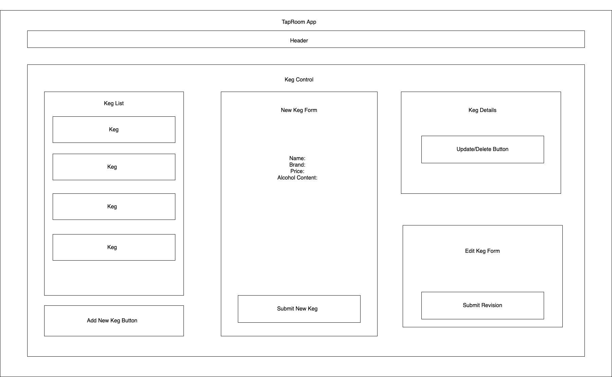

# _React-Redux Tap Room_

#### _A React web application using Redux to handle state for Creating, Reading, Updating and Deleting kegs of beer_

#### By _Ryan Walker_

## Description
This application will allow a user to create, view and update details, and delete different kegs of beer for an imaginary tap room. This application also keeps track of how many pints of beer remain available for each keg.

## Components

## User Stories
* As a user, I want to see a list/menu of all available kegs. For each keg, I want to see its name, brand, price and alcoholContent (or perhaps something like flavor for a kombucha store).
* As a user, I want to submit a form to add a new keg to a list.
* As a user, I want to be able to click on a keg to see its detail page.
* As a user, I want to see how many pints are left in a keg. Hint: A full keg has roughly 124 pints.
* As a user, I want to be able to click a button next to a keg whenever I sell a pint of it. This should decrease the number of pints left by 1. Pints should not be able to go below 0.

## Setup and Use

### Prerequisites
* A text editor like [VS Code](https://code.visualstudio.com/)
* A command line interface like Terminal or GitBash to run and interact with the app.

### Installation
1. Clone the repository: `$ git clone https://github.com/RyanDanielWalker/tap-room-redux`
2. Navigate to the `/tap-room-redux` directory on your computer
3. Open with your preferred text editor to view the code base
4. To run the app:
    * Run the command `npm start` to run the project!
    * View the application via your preferred web browser by visiting `localhost:3000/`

## Known Bugs
* No bugs identified

## Technologies Used
* JavaScript
* React
* Redux
* JSX
* VS Code
* NPM
* Git
* GitHub
* Webpack

### License

MIT

Copyright (c) 2021 _Ryan Walker_

## Contact Information
[Ryandanielwalker@gmail.com](mailto:ryandanielwalker@gmail.com)